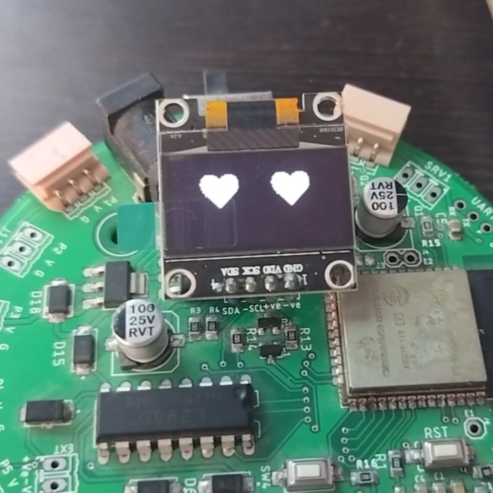
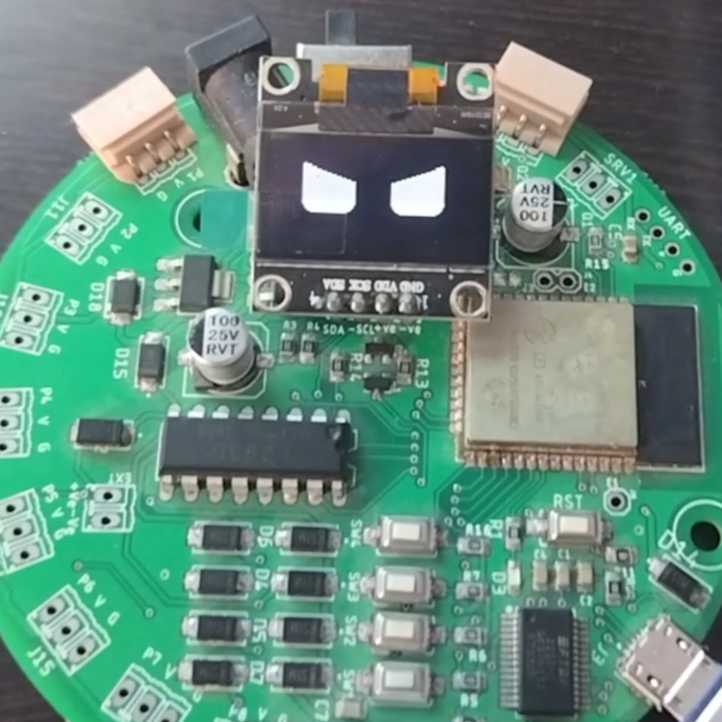
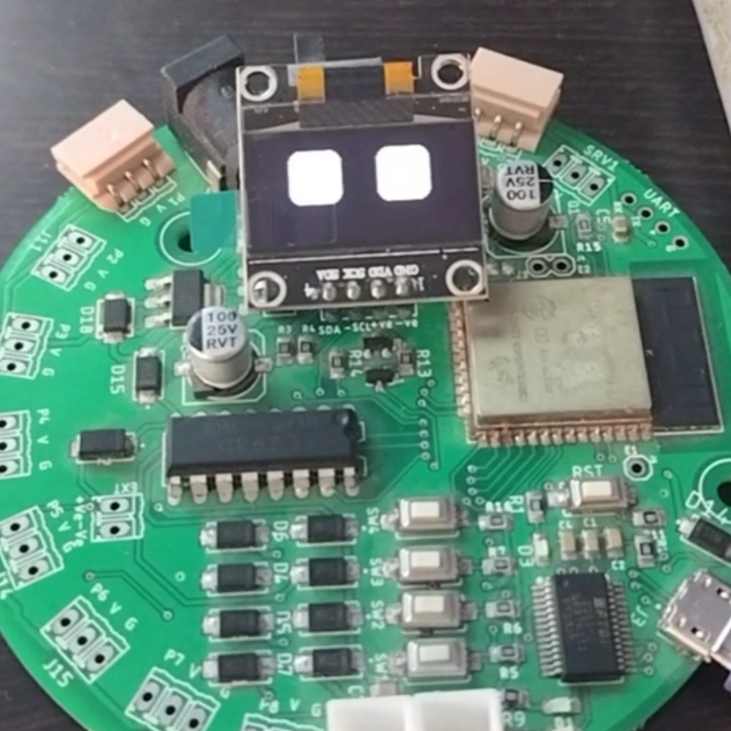
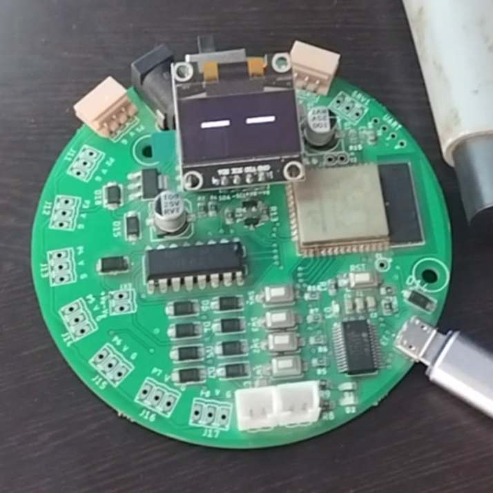

# Sentiment_Analysis_EMO_EYES
AnimO-Eye (pronounced AN-i-moh-eye, derived from Animation-Emotion-Eye) is an innovative project that brings emotional intelligence to robotics. It features a dynamic robotic eye animation on a 0.96" OLED screen, which adapts based on the sentiment of user-input text. Powered by the CAP10 Pratham, a proudly made-in-India microcontroller board.

 

 


Features

    Real-Time Sentiment Analysis – Detects sentiment from user speech, converts it to text, and analyzes emotions.

    Emotional Intelligence – Enhances interaction by enabling robots to visually express emotions.

    Compact Design – Utilizes a 0.96" OLED screen for a minimal yet effective display.

    Cost-Effective – Powered by the CAP10 Pratham, an affordable microcontroller for integrating emotional responses in robotics.

Hardware Components

    System/Edge Computing Device – Any system capable of running sentiment analysis.

    CAP10 Pratham – A microcontroller that controls the OLED screen and processes requests from the master system.

    0.96" OLED Display – A compact screen for animated eye expressions.

    Power Supply – Ensures stable and consistent operation.

Software Requirements

    Python – Used for sentiment analysis via LSTM (Long Short-Term Memory) models.

    Arduino IDE – Required for programming the CAP10 Pratham and controlling the OLED display.

Required Libraries

    Python Dependencies – Refer to requirements.txt.

    Arduino Libraries:

        ESP32 Board Manager – For programming the CAP10 Pratham.

        Adafruit_SSD1306 & Adafruit_GFX – For handling OLED graphics.

How It Works

    Model Training (Optional) – Train the sentiment analysis model using the provided dataset in the data directory or custom data in the same format. The trained model will be used for predictions.

    Sentiment Analysis – User speech is transcribed into text using WhisperX, and sentiment is classified using the LSTM model.

    Animation Update – The CAP10 Pratham receives sentiment data via an API call and updates the OLED display with the corresponding eye animation (e.g., happy, sad, surprised).


### **Installation Guide**  

#### **Software Setup**  
1. **Install Git LFS** (if not already installed):  
   ```bash
   git lfs install
   ```  
2. **Clone the Repository**:  
   ```bash
   git clone https://github.com/Parag-IIT/Sentiment_Analysis_EMO_EYES/tree/main
   ```  
3. **Install Required Python Packages**:  
   ```bash
   pip install -r requirements.txt
   ```  
4. **Upload the Arduino Code**:  
   - Navigate to the `Display_Emotion` directory.  
   - Open the code in **Arduino IDE**.  
   - Select **ESP32 Dev Module** as the board.  
   - Upload the code to the **CAP10 Pratham** board.  

#### **Hardware Setup**  
- Connect the **0.96" OLED display** to the **CAP10 Pratham** board as per the **circuit diagram**.    


### **Usage**  

1. **(Optional) Train the Model**  
   - Run **`Sentiment Analysis.ipynb`** in **Jupyter Notebook** to train the sentiment analysis model.  

2. **Connect to the CAP10 Pratham Board**  
   - Once the **Arduino code** is successfully uploaded and the device is powered on, a **Wi-Fi Access Point** named **"CAP10 Eye"** will appear.  
   - Connect to this network from the **master system** (where the sentiment analysis script runs) using the password: **12345678**.  

3. **Run Sentiment Analysis & Integration**  
   - Open and execute **`Prediction and Integration.ipynb`** in **Jupyter Notebook**.  

4. **Observe the Animation**  
   - Provide text input, and watch the **OLED display** update the robotic eye animation based on the detected sentiment.  

---

### **Applications**  

- **Interactive Robotics** – Enhances human-robot interaction through **emotion-based visual expressions**.  
- **Educational Projects** – Great for teaching **emotional intelligence in robotics**.  
- **Prototype Development** – Serves as a foundation for **advanced emotionally responsive robotic systems**.  